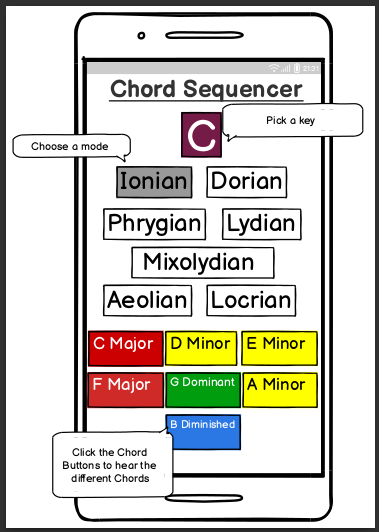
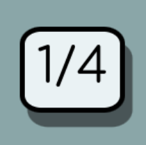
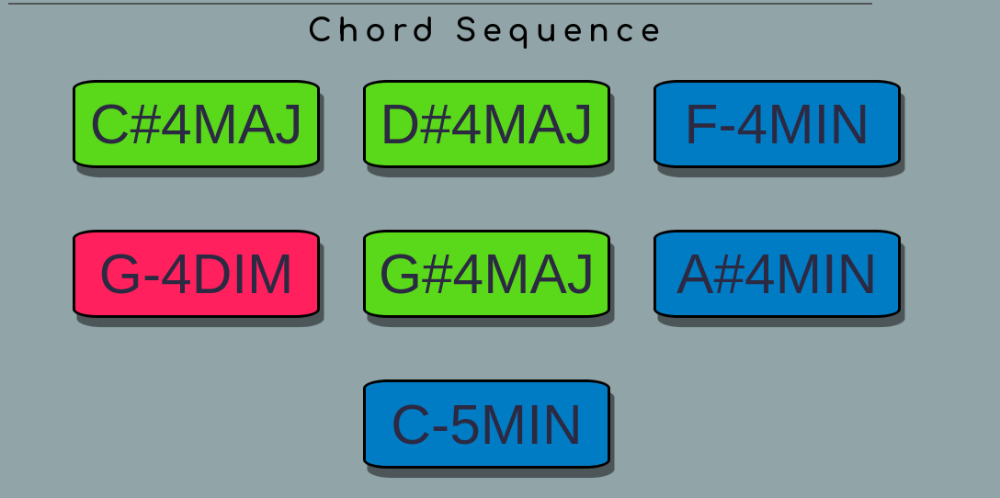
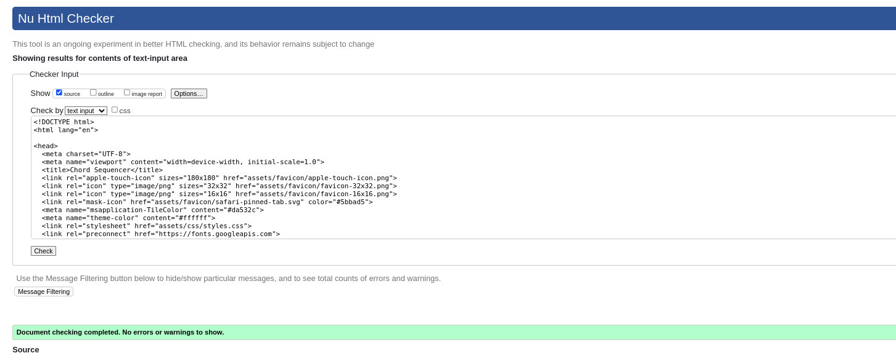
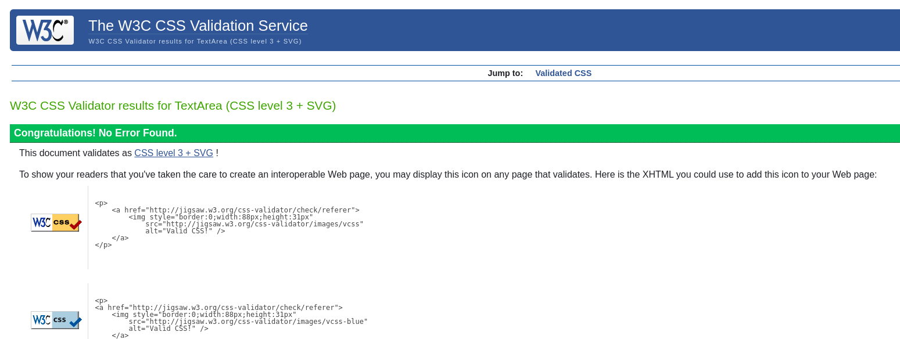
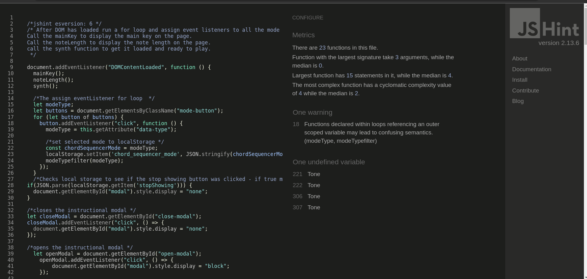
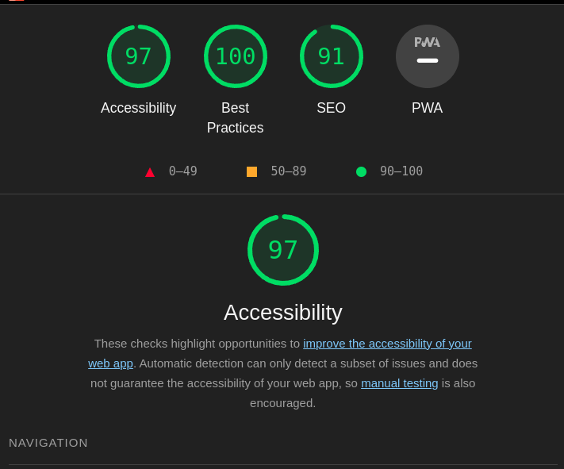

# Chord Sequencer
The Chord Sequencer App is a song writing tool. It aids musicians during the basic song creation process. Singers, rappers, young musicians or songwriters stuck in a rut will use the Chord Sequencer to find the next chord in a progression or to spice up an already written composition. It is aimed at users that don’t have a vast knowledge of music theory. Chord Sequencer will help them stay in the flow.

# Live Site
https://drekkg.github.io/chord_sequencer/

# Repository
https://github.com/Drekkg/chord_sequencer

# Author
Derek Garnett

### Who the Git is DerekIto?
During a long train ride I did some work on this project using the company's laptop. I have been working in VS Code as a couple of months ago Codeanywhere stopped working. I initialised my repo on the command line and proceeded to push a few commits, five in total. I opened GitHub in my browser and was shocked to see that those five commits were attributed to a user called DerekIto - someone I don't know!
Somehow my username and his got mixed up by GitHub - to be fair it was probably me, probably a typo when I entered my username on the command line. So just to clarify, as I have already clarified to student care - although my namesake is listed as a contributor with a total of five commits, the work is 100% mine(apart from Tone.js a third party library), all the commits in his name were actually made by me. 

# UX

## Target Audience
Chord Sequencer is aimed at songwriters, musicians and music students.

## Project Goal
- Get stuck songwriters out of a rut.
- Introduce modes to young musicians.
- Help music students understand the various modes.
- A teaching aid to music teachers 

Example: A musician writing a song on their guitar or piano, have written a song with two or maybe three chords and a basic melody, but they are stuck as to what they should play next. The chords they have at the moment - D Major, E Minor and G Major - sound nice and work well together. But the song sounds dull and uninspired - it’s missing something. The user opens the app and clicks on the main key selector tab and selects the key of D. They then select one of the modes - they select the first mode which is the Ionian mode. The seven coloured blocks below, then display the seven chords in the D Ionian mode: D Major - E Minor - F# Minor - G Major - A Major - B Minor - C# Diminished. The user notices that all three of the chords in their song are in the scale: D Major, E Minor and G Major. There are also four other Chords in the scale which should work in their song. The user then experiments adding the chords to their song, either on their own instrument or by auditioning it in the browser by clicking on the chord squares, which will sound the chords using an online synthesiser. By experimenting with different chords and modes, the user will discover a plethora of different chord flavours. The user will realise that the Chord Sequencer app is a beneficial aid in the creative process.

## Develepor Goals
- Create a useful tool
- Progress my Javascript and overall skills
  
## Design Choices
Striving to make an uncluttered design with an app that has so many buttons on a single page turned out to be quite the challenge. 

The chord buttons that sounds the chords are grouped togethor on mobile devices so that they are easy to click with your thumb.
On bigger screens, I restricted the interface width so that the user doesn't have to move the from one side of the screen to the other to trigger sounds.
I also tried to make easy to switch keys and modes, so the user quickly audition different keys and modes.

### Colour Choice
I used a variety of bright colours on the interface in an effort to make it look young and fun.
They also serve a purpose and will help the user to quickly identify the different chord shapes.
as follows:
Major chords are green.
Minor chords are blue.
Diminished chords are light red.
The selected mode is purple.

### Wire Frame  
The basic wireframe design.

# Features
Chord Sequencer has many interactive elements i.e buttons and two distinct "states".
An instructional modal page and the main interface.

### Modal Instructional Page
The first is an instructional modal that opens when the app is first loaded.
It contains brief instructions on how to use the app. It also contains a button to close the modal and show the user the main interface and a button to stop showing the modal on load and bring the user straight to the main interface.

Once the user clicks on the stop showing button, it uses local storage to stop showing the modal next time the user opens the app.

On the main interface is a show modal button in the shape of a question mark. Clicking on this button brings the user back to the instructional modal.

### Main Interface 
The Main interface contains the core of the app. 
Up and Down arrows to select the main key/root note. 
Seven Mode selection buttons.
Seven Chord Trigger buttons.
One note length selctor button.
The interactive elements in detail:

#### The Main Key Section

The Main key Box displays the main key or root note. The display changes depending on the note chosen using the arrows.

The Up and Down Arrows change the main key. The main key is displayed in the main key box. The main key is used to determine the chords in the mode. The arrows cycle through the notes. Clicking up all the way will bring you back to the starting point. The same applies to the down button. It is a user centric feature that allows the user to quickly audition different keys.

The note length selector button is a feature that allows the user to change the length of the notes played by the chord buttons. The user can select from a whole note, half note, quarter note and an eighth note. Clicking on the button cycles through the different note lengths. 

#### The Mode Section
The mode section consists of seven buttons each representing the different modes. The modes are Ionian, Dorian, Phrygian, Lydian, Mixolydian, Aeolian and Locrian. Each mode has a different flavour and a different arrangement of chords. Click here for a description of the different modes. https://www.productionmusiclive.com/blogs/news/musical-modes-and-their-emotions-characteristics-for-edm. The selected mode is highlighted in purple. The chords in the chord section will change to reflect the chords in the selected mode.

#### Local Storage
The app uses local storage to store the user's last selected key and mode. When the user opens the app, the last selected key and mode are displayed. That way the user can pick up where they left off.

#### The Chord Sequence Section
The Chord Sequence Section is the main feature of the app. It consists of seven buttons each representing a chord in the selected mode. The chords are displayed in the order they appear in the mode.
Each button changes colour according to the type of chord it represents. Major chords are green, minor chords are blue and diminished chords are light red. The user can click on the buttons to hear the how the chords sound and experiment with different chord progressions, or keep the same same progression only changing the mode or key.

### Future Features
I demo'd the app a music teacher friend and some musician friends, who were quite enthused. They made a few suggestions that I would like to implement in the future.
- A feature that allows the user to record and save chord progressions.
- A loop feature that allows the user to loop a chord progression.
- The ability to change the sounds triggered by the chords. To choose between a piano, guitar or synth sound. This is a feature high on my list as I think the sounds at the moment are a bit clangy and could be improved. A high quality piano sound would make the app a more professional tool.

### Technologies Used
Languages used:
- HTML
- CSS
- Javascript

Frameworks and Libraries:
Tone.js
Tone.js is a Web audio library for creating audio in the browser. A fantastic library that I only scratched the surface of. It has a lot of features that I would like to explore in the future. It was used to trigger the chords in the app.
https://tonejs.github.io/
created by Yotam Mann.

Other Technologies:
- Git
- GitHub
- VS Code
- Chrome Dev Tools
- Balsamiq
- W3C Nu HTML Markup Validation Service
- Stack Overflow
- Co Pilot - included with the GitHub student pack. I used it a bit for refactoring.
- Gimp - for image editing.
- Font Awesome - for the icons.
- Google Fonts - for the font.
- coolours.co - for the colour scheme.
- JSHint - for Javascript validation.
- W3C CSS Validation Service - for CSS validation.

### Testing
Chord Sequencer was tested on a variety of real and virtual devices. Smartphones, tablets and desktops.
#### Compatibility and Responsiveness
The app was tested on the following browsers and devices:
| TOOL / Device                 | BROWSER     | OS         | SCREEN WIDTH  |
|-------------------------------|-------------|------------|---------------|
| Real phone: S20 Ultra         | Chrome 120  | android 13 | M  412 x 915  |
|             Hauwei p20        | Chrome 120  | android 11 | M  375 x 768  |
| Real laptop asus              | Firefox 121 | linux pop  | LG1920x1080   | 
| Dev tools emulator: pixel 7   | chrome 120  | android 13 | M  412 x 915  |
|                     iPhone 12 | firefox 121 |  iOs 14    | M  428 x 926  |
|           Samsung galaxy fold | Chrome 120  | android 12 | XS 280 x 653  |
|           Samsung galaxy s8   | firefox 121 | android 8  |  S 360 x 740  |
| Real tablet: samsung s6       | Chrome 118  | android 10 | L 1600 x 2560 |
| Real computer:  windows pc    | IE Edge 88  | windows 10 | XL 1920 x 964 |

Making this app responsive was a real challenge, but I think I did a good job. The app looks good on all devices and the buttons are easy to click. The app was tested on a variety of devices and browsers and it looks good and works well on all of them.

#### Validation
HTML was validated using the W3C Nu HTML Markup Validation Service. No errors were found.

CSS was validated using the W3C CSS Validation Service. No errors were found.

Javascript was validated using JSHint. No errors were found.

Their were a few warnings:
- outer  variable referenced  in loop, which was mentioned in the course work as being acceptable.
- Unknown variable 'Tone' which is in the third party library. 
#### Accessibility
The app was tested for accessibility using Lighthouse in Chrome Dev Tools. The app scored over 95% for accessibility.

#### Manual Testing 
- The app was tested manually by clicking on the various buttons:
- The note length selector button was tested by clicking on it and checking that the note length changed.
- The up and down arrows were tested by clicking on them and checking that the main key changed.
- The mode buttons were tested by clicking on them and checking that the mode changed.
- Each mode was selected and tested to make sure the correct chords for the mode were displayed.
- Each chord in the mode was also clicked to make sure it not only worked but also sounded the correct chord.
- The show modal button was tested by clicking on it and checking that the modal opened.
- The local storage was also tested by selcting a key and mode, closing the app and reopening to check the corrrect key and mode were displayed. Local storage for the modal was also erased in the browser settings and the app was opened to check that the modal opened on load.
- Javascript was also disabled in the browser to check that the Javascript not enabled message was displayed.

### Bugs
There were a lot of bugs during development that were fixed along the way. Stack Overflow was an invaluable resource in this regard. Also the js validator showed up a few errors on the first couple of passes.
#### Major Bug
A major hair pulling bug,was where multiple event listeners were being added to a single button. Which caused a single chord button to trigger multiple notes from different keys. Causing a cacophony. It was really tricky to track down the cause, because it would only happen after I changed the root note. The bug was eventually  tracked down to event listeners being added in a for each loop each time the key or mode was changed. The fix was to change the order, first create the event listeners and then have the event listener call a function that parses the inner HTML changing the chord, key and mode to be played.  

